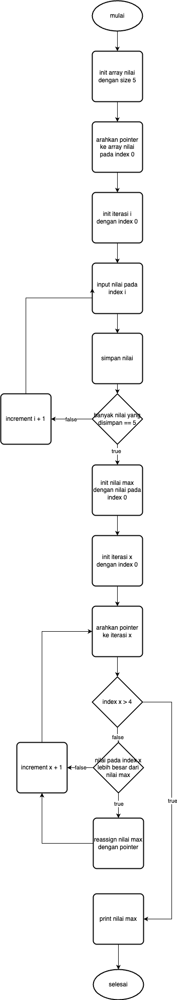

# Personal Assignment 2

## Tugas 1

1. missing include library

    ```c
    #include
    ```

    seharusnya

    ```c
    #include <stdio.h>
    ```

2. wrong pointer arithmetic syntax

    ```c
    *(ptr + i) = *(i + ptr - 1) + *(i + ptr - 2);
    ```

    - walaupun bisa dicompile, expression `i + ptr - 1` dan `i + ptr - 2` kurang mudah dipahami
    - secara teknis bisa karena urutan operator asosiatif (prioritas eksekusi operator +/- dari kiri ke kanan).

## Tugas 2


