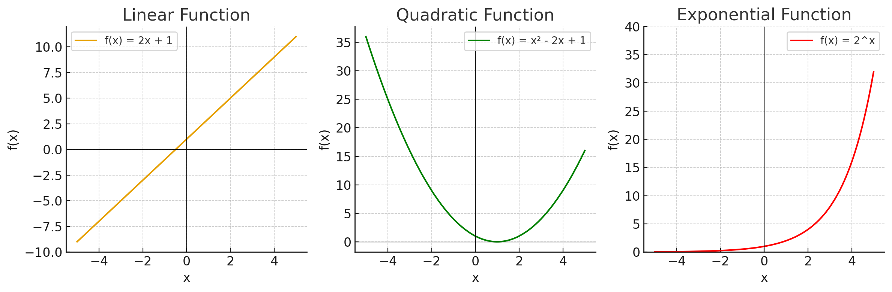

# Personal Assignment Calculus 1

## 1. Bagaimana kalkulus dapat digunakan dalam sains dan teknologi

Kalkulus adalah alat matematika untuk menganalisis perubahan (derivatif/turunan) dan akumulasi (integral). Dua konsep ini sangat penting dalam hampir semua bidang sains dan teknologi karena banyak fenomena alam dan buatan manusia bersifat dinamis (berubah seiring waktu atau ruang).

## 2. Apa peran fungsi dalam kalkulus? Sebutkan minimal 3 contoh fungsi beserta variabel dependent dan independent-nya

Fungsi adalah jembatan utama dalam kalkulus.

- Kalkulus mempelajari perubahan (turunan/derivative) dan akumulasi (integral) dari suatu fungsi.  
- Fungsi menghubungkan variabel bebas (*independent*) dengan variabel terikat (*dependent*).  
- Dengan fungsi, kita bisa memodelkan fenomena alam, teknologi, maupun sosial sehingga dapat dianalisis secara matematis.  

Tanpa fungsi, kalkulus tidak punya "objek" yang bisa dianalisis.

### 3 Contoh Fungsi dalam Kalkulus

**Fungsi Suhu Air yang Dipanaskan**  
- Fungsi: $T(t)=20+2t$  
- Variabel independent: $t$ (waktu, menit)  
- Variabel dependent: $T$ (suhu air, °C)  

**Fungsi Harga Buah**  
- Fungsi: $H(w)=10w$  
- Variabel independent: $w$ (berat buah, kg)  
- Variabel dependent: $H$ (harga dalam ribu rupiah)  

**Fungsi Jarak Tempuh**  
- Fungsi: $s(t)=60t$  
- Variabel independent: $t$ (waktu, jam)  
- Variabel dependent: $s$ (jarak, km)  

## 3. Sebutkan 3 jenis fungsi dan gambarkan dalam bentuk graph 

1. **Fungsi Linear**  
   - Bentuk umum: $f(x)=ax+b$  
   - Contoh: $f(x)=2x+1$  
   - Ciri: garis lurus, perubahan konstan.  

2. **Fungsi Kuadrat**  
   - Bentuk umum: $f(x)=ax^2+bx+c$  
   - Contoh: $f(x)=x^2−2x+1$  
   - Ciri: parabola, bisa membuka ke atas ($a > 0$) atau ke bawah ($a < 0$).  

3. **Fungsi Eksponensial**  
   - Bentuk umum: $f(x)=a^x$, dengan $a>1$  
   - Contoh: $f(x)=2^x$  
   - Ciri: pertumbuhan cepat, grafik naik tajam.  

## 4. Tentukan nilai limit berikut

**a)** $\displaystyle \lim_{x \to 4} \frac{x^2 + 3x}{x^2 - x - 12}$  

1. Faktorkan pembilang dan penyebut:  
   $x^2 + 3x = x(x+3)$,  
   $x^2 - x - 12 = (x-4)(x+3)$.  

2. Sederhanakan (untuk $x \neq -3$):  
   $\dfrac{x(x+3)}{(x-4)(x+3)} = \dfrac{x}{x-4}$.  

3. Periksa limit saat $x \to 4$:  
   - Jika $x \to 4^-$, maka $x-4 \to 0^-$ → $\dfrac{x}{x-4} \to -\infty$.  
   - Jika $x \to 4^+$, maka $x-4 \to 0^+$ → $\dfrac{x}{x-4} \to +\infty$.  

**Kesimpulan:** Limit **tidak ada** (divergen ke $-\infty$ dan $+\infty$).  

---

**b)** $\displaystyle \lim_{x \to 9} \frac{9-x}{3-\sqrt{x}}$  

1. Kalikan dengan sekawan penyebut:  
   $\dfrac{9-x}{3-\sqrt{x}} \cdot \dfrac{3+\sqrt{x}}{3+\sqrt{x}} = \dfrac{(9-x)(3+\sqrt{x})}{9-x}$.  

2. Sederhanakan:  
   $= 3 + \sqrt{x}, \quad (x \neq 9)$.  

3. Ambil limit saat $x \to 9$:  
   $\lim_{x \to 9} (3+\sqrt{x}) = 3+3 = 6$.  

**Kesimpulan:** Nilai limit = **6**.  

## 5. Tentukan nilai limit berikut

**a)** $\displaystyle \lim_{x \to 3} \frac{\tfrac{1}{x} - \tfrac{1}{3}}{x-3}$  

1. Satukan pembilang:  
   $\dfrac{1}{x} - \dfrac{1}{3} = \dfrac{3 - x}{3x}$.  

2. Substitusi ke bentuk awal:  
   $\dfrac{\tfrac{3-x}{3x}}{x-3} = \dfrac{3-x}{3x(x-3)}$.  

3. Perhatikan $3-x = -(x-3)$, jadi:  
   $\dfrac{3-x}{3x(x-3)} = \dfrac{-(x-3)}{3x(x-3)} = -\dfrac{1}{3x}$.  

4. Ambil limit saat $x \to 3$:  
   $\lim_{x\to 3} -\dfrac{1}{3x} = -\dfrac{1}{9}$.  

**Kesimpulan (a):** $\displaystyle -\tfrac{1}{9}$.  

---

**b)** $\displaystyle \lim_{x \to 16} \frac{4-\sqrt{x}}{16x - x^2}$  

1. Cek substitusi langsung $x=16$:  
   - Pembilang: $4-\sqrt{16}=0$.  
   - Penyebut: $16\cdot16 - 16^2 = 0$.  
   → Bentuk tak tentu $\tfrac{0}{0}$.  

2. Faktorkan penyebut:  
   $16x - x^2 = x(16 - x)$.  
   Jadi bentuk menjadi $\dfrac{4-\sqrt{x}}{x(16-x)}$.  

3. Kalikan pembilang dan penyebut dengan sekawan $4+\sqrt{x}$:  
   $\dfrac{4-\sqrt{x}}{x(16-x)} \cdot \dfrac{4+\sqrt{x}}{4+\sqrt{x}} = \dfrac{(4-\sqrt{x})(4+\sqrt{x})}{x(16-x)(4+\sqrt{x})}$.  

4. Sederhanakan karena $(4-\sqrt{x})(4+\sqrt{x}) = 16 - x$:  
   $= \dfrac{16-x}{x(16-x)(4+\sqrt{x})} = \dfrac{1}{x(4+\sqrt{x})}$.  

5. Ambil limit saat $x \to 16$:  
   $\lim_{x\to 16} \dfrac{1}{x(4+\sqrt{x})} = \dfrac{1}{16(4+4)} = \dfrac{1}{128}$.  

**Kesimpulan (b):** $\displaystyle \tfrac{1}{128}$