# Tugas Personal ke-2 Week 7
# Jawaban Soal Review: Single Linked List

## 1. Pengertian Single Linked List

**Single Linked List** adalah struktur data linear yang terdiri dari kumpulan node yang saling terhubung secara sekuensial. Setiap node memiliki dua komponen:
- **Data**: menyimpan nilai/informasi
- **Pointer (next)**: menyimpan alamat node berikutnya

### Struktur Node

```mermaid
graph LR
    subgraph Node
        direction LR
        D[📦 Data]
        P[➡️ Next Pointer]
    end
```



### Ilustrasi Cara Membuat Single Linked List

#### Langkah 1: Buat Node Pertama (HEAD)


#### Langkah 2: Tambah Node Kedua


#### Langkah 3: Tambah Node Ketiga (Final)


### Proses Pembuatan (Flowchart)

```mermaid
flowchart TD
    A[🚀 Start] --> B{List Kosong?}
    B -->|Ya| C[Buat Node Baru]
    C --> D[Set HEAD = Node Baru]
    D --> E[Node.next = NULL]
    E --> Z[✅ Selesai]
    
    B -->|Tidak| F[Buat Node Baru]
    F --> G[Traverse ke Node Terakhir]
    G --> H[Set LastNode.next = Node Baru]
    H --> I[Node Baru.next = NULL]
    I --> Z
    
    style A fill:#4CAF50,color:#fff
    style Z fill:#4CAF50,color:#fff
    style B fill:#FF9800,color:#fff
```



---

## 2. Representasi Linked List dalam Memori

Linked list direpresentasikan dalam memori menggunakan alamat memori yang tersebar (tidak harus berurutan). Setiap node menyimpan DATA dan NEXT (alamat node berikutnya).

### Contoh: Menyimpan List A → B → C → D

#### Tabel Representasi Memori

| Alamat Memori | DATA | NEXT (Pointer) |
|:-------------:|:----:|:--------------:|
| 1000          | C    | 1003           |
| 1001          | A    | 1002           |
| 1002          | B    | 1000           |
| 1003          | D    | NULL           |

**HEAD = 1001** (menunjuk ke node pertama)

### Visualisasi Memori Fisik vs Logis

#### Memori Fisik (Data Tersebar)

```mermaid
graph TB
    subgraph Memory["🖥️ Physical Memory Layout"]
        M1000["📍 1000<br/>Data: C<br/>Next: 1003"]
        M1001["📍 1001<br/>Data: A<br/>Next: 1002"]
        M1002["📍 1002<br/>Data: B<br/>Next: 1000"]
        M1003["📍 1003<br/>Data: D<br/>Next: NULL"]
    end
    
    style M1000 fill:#e74c3c,color:#fff
    style M1001 fill:#3498db,color:#fff
    style M1002 fill:#2ecc71,color:#fff
    style M1003 fill:#9b59b6,color:#fff
```



#### Urutan Logis (Traversal dari HEAD)

```mermaid
graph LR
    HEAD["🎯 HEAD<br/>(1001)"] --> A
    
    subgraph A["📍 1001"]
        DA[Data: A]
    end
    
    A -->|"next: 1002"| B
    
    subgraph B["📍 1002"]
        DB[Data: B]
    end
    
    B -->|"next: 1000"| C
    
    subgraph C["📍 1000"]
        DC[Data: C]
    end
    
    C -->|"next: 1003"| D
    
    subgraph D["📍 1003"]
        DD[Data: D]
    end
    
    D -->|"next: NULL"| NULL[⬚ NULL]
    
    style HEAD fill:#ff6b6b,color:#fff
    style A fill:#3498db,color:#fff
    style B fill:#2ecc71,color:#fff
    style C fill:#e74c3c,color:#fff
    style D fill:#9b59b6,color:#fff
    style NULL fill:#7f8c8d,color:#fff
```



### Proses Traversal


---

## 3. Perbandingan Linked List vs Array

### Tabel Perbandingan

| Aspek | Array | Linked List |
|-------|-------|-------------|
| **Ukuran** | Tetap (fixed) | Dinamis |
| **Alokasi Memori** | Kontinu (berurutan) | Non-kontinu (tersebar) |
| **Akses Elemen** | Random access O(1) | Sequential access O(n) |
| **Insert di Awal** | O(n) | O(1) |
| **Insert di Tengah** | O(n) | O(n) cari + O(1) insert |
| **Delete** | O(n) | O(1) setelah ditemukan |
| **Memory Overhead** | Tidak ada | Ada (untuk pointer) |
| **Cache Performance** | Baik | Kurang baik |

### Visualisasi Perbandingan Memori

#### Array (Kontinu)

```mermaid
graph LR
    subgraph Array["📊 Array - Memori Kontinu"]
        A0["[0]<br/>10"] --> A1["[1]<br/>20"] --> A2["[2]<br/>30"] --> A3["[3]<br/>40"] --> A4["[4]<br/>50"]
    end
    
    style A0 fill:#3498db,color:#fff
    style A1 fill:#3498db,color:#fff
    style A2 fill:#3498db,color:#fff
    style A3 fill:#3498db,color:#fff
    style A4 fill:#3498db,color:#fff
```



#### Linked List (Tersebar)

```mermaid
graph LR
    subgraph LL["🔗 Linked List - Memori Tersebar"]
        H((HEAD)) --> N1["10<br/>➡️"] --> N2["20<br/>➡️"] --> N3["30<br/>➡️"] --> N4["40<br/>➡️"] --> N5["50<br/>➡️"] --> NULL[NULL]
    end
    
    style H fill:#e74c3c,color:#fff
    style N1 fill:#2ecc71,color:#fff
    style N2 fill:#9b59b6,color:#fff
    style N3 fill:#f39c12,color:#fff
    style N4 fill:#1abc9c,color:#fff
    style N5 fill:#e91e63,color:#fff
```



### Perbandingan Operasi Insert di Awal

#### Array: Insert di Awal - O(n)

```mermaid
graph TB
    subgraph Before["Sebelum Insert 5"]
        A1["10"] --> A2["20"] --> A3["30"]
    end
    
    subgraph Process["⚠️ Harus Geser Semua Elemen"]
        P1["30 → geser"] 
        P2["20 → geser"]
        P3["10 → geser"]
        P4["5 → masuk"]
    end
    
    subgraph After["Setelah Insert 5"]
        B1["5"] --> B2["10"] --> B3["20"] --> B4["30"]
    end
    
    Before --> Process --> After
    
    style Process fill:#ffcccc
```



#### Linked List: Insert di Awal - O(1)


### Kapan Menggunakan?

```mermaid
graph TD
    Q{Kebutuhan Anda?}
    
    Q -->|Ukuran tetap<br/>Akses random| AR[✅ Gunakan ARRAY]
    Q -->|Ukuran dinamis<br/>Sering insert/delete| LL[✅ Gunakan LINKED LIST]
    
    AR --> AR1[📌 Index lookup]
    AR --> AR2[📌 Sorting algorithms]
    AR --> AR3[📌 Matrix operations]
    
    LL --> LL1[📌 Queue implementation]
    LL --> LL2[📌 Undo functionality]
    LL --> LL3[📌 Dynamic memory]
    
    style AR fill:#3498db,color:#fff
    style LL fill:#2ecc71,color:#fff
```



### Kesimpulan

**Tidak ada yang "lebih baik" secara absolut** - pemilihan tergantung pada kebutuhan:
- **Array**: Ketika butuh akses cepat ke elemen tertentu dan ukuran sudah diketahui
- **Linked List**: Ketika sering melakukan operasi insert/delete dan ukuran data berubah-ubah


# Jawaban Case
DatabaseMahasiswa.java

```java
import java.util.Scanner;

/**
 * Program Database Mahasiswa Sederhana
 * Menggunakan Single Linked List
 * 
 * Fitur:
 * 1. Push data mahasiswa (dengan validasi)
 * 2. Tampilkan semua data (sorted by NIM)
 * 3. Pop semua data
 * 4. Keluar program
 */

// Class Node untuk menyimpan data mahasiswa
class NodeMahasiswa {
    String nim;
    String nama;
    String jurusan;
    NodeMahasiswa next;
    
    // Constructor
    public NodeMahasiswa(String nim, String nama, String jurusan) {
        this.nim = nim;
        this.nama = nama;
        this.jurusan = jurusan;
        this.next = null;
    }
}

// Class Single Linked List untuk database mahasiswa
class LinkedListMahasiswa {
    private NodeMahasiswa head;
    private int size;
    private static final int MAX_SIZE = 5;
    
    // Constructor
    public LinkedListMahasiswa() {
        this.head = null;
        this.size = 0;
    }
    
    // Cek apakah list kosong
    public boolean isEmpty() {
        return head == null;
    }
    
    // Cek apakah list penuh
    public boolean isFull() {
        return size >= MAX_SIZE;
    }
    
    // Mendapatkan jumlah data
    public int getSize() {
        return size;
    }
    
    // Push data mahasiswa (insert di akhir)
    public boolean push(String nim, String nama, String jurusan) {
        // Validasi kapasitas
        if (isFull()) {
            System.out.println("\n[ERROR] Database penuh! Maksimal " + MAX_SIZE + " data.");
            return false;
        }
        
        // Cek NIM duplikat
        if (isDuplicateNim(nim)) {
            System.out.println("\n[ERROR] NIM " + nim + " sudah terdaftar!");
            return false;
        }
        
        // Buat node baru
        NodeMahasiswa newNode = new NodeMahasiswa(nim, nama, jurusan);
        
        // Jika list kosong, node baru menjadi head
        if (isEmpty()) {
            head = newNode;
        } else {
            // Traverse ke node terakhir
            NodeMahasiswa current = head;
            while (current.next != null) {
                current = current.next;
            }
            // Sambungkan node baru di akhir
            current.next = newNode;
        }
        
        size++;
        return true;
    }
    
    // Cek apakah NIM sudah ada
    private boolean isDuplicateNim(String nim) {
        NodeMahasiswa current = head;
        while (current != null) {
            if (current.nim.equals(nim)) {
                return true;
            }
            current = current.next;
        }
        return false;
    }
    
    // Menampilkan semua data (sorted by NIM menggunakan Bubble Sort)
    public void displaySorted() {
        if (isEmpty()) {
            System.out.println("\n╔══════════════════════════════════════════════════════════════════════════════════════════════╗");
            System.out.println("║                              DATABASE KOSONG - Tidak ada data mahasiswa                      ║");
            System.out.println("╚══════════════════════════════════════════════════════════════════════════════════════════════╝");
            return;
        }
        
        // Sorting linked list berdasarkan NIM (Bubble Sort)
        sortByNim();
        
        // Header tabel
        System.out.println("\n╔════════════════════════════════════════════════════════════════════════════════════════════════╗");
        System.out.println("║                                    DAFTAR MAHASISWA                                            ║");
        System.out.println("║                                  (Sorted by NIM)                                               ║");
        System.out.println("╠════════╦══════════════╦════════════════════════════════╦═══════════════════════════════════════╣");
        System.out.println("║  No.   ║     NIM      ║              NAMA              ║                JURUSAN                ║");
        System.out.println("╠════════╬══════════════╬════════════════════════════════╬═══════════════════════════════════════╣");
        
        // Traverse dan tampilkan data
        NodeMahasiswa current = head;
        int no = 1;
        while (current != null) {
            System.out.printf("║  %-4d  ║ %-12s ║ %-30s ║ %-37s ║%n", 
                no++, 
                current.nim, 
                current.nama, 
                current.jurusan);
            current = current.next;
        }
        
        System.out.println("╠════════╩══════════════╩════════════════════════════════╩═══════════════════════════════════════╣");
        System.out.printf("║  Total Data: %-81d ║%n", size);
        System.out.println("╚════════════════════════════════════════════════════════════════════════════════════════════════╝");
    }
    
    // Sorting linked list berdasarkan NIM (Bubble Sort)
    private void sortByNim() {
        if (head == null || head.next == null) {
            return; // Tidak perlu sorting jika 0 atau 1 elemen
        }
        
        boolean swapped;
        do {
            swapped = false;
            NodeMahasiswa current = head;
            
            while (current.next != null) {
                // Bandingkan NIM (string comparison)
                if (current.nim.compareTo(current.next.nim) > 0) {
                    // Swap data (bukan node)
                    String tempNim = current.nim;
                    String tempNama = current.nama;
                    String tempJurusan = current.jurusan;
                    
                    current.nim = current.next.nim;
                    current.nama = current.next.nama;
                    current.jurusan = current.next.jurusan;
                    
                    current.next.nim = tempNim;
                    current.next.nama = tempNama;
                    current.next.jurusan = tempJurusan;
                    
                    swapped = true;
                }
                current = current.next;
            }
        } while (swapped);
    }
    
    // Pop semua data mahasiswa
    public void popAll() {
        if (isEmpty()) {
            System.out.println("\n[INFO] Database sudah kosong, tidak ada data untuk di-pop.");
            return;
        }
        
        System.out.println("\n╔══════════════════════════════════════════════════════════════════════════════════════════════╗");
        System.out.println("║                                PROSES POP SEMUA DATA                                         ║");
        System.out.println("╚══════════════════════════════════════════════════════════════════════════════════════════════╝");
        
        int count = 0;
        while (head != null) {
            count++;
            System.out.printf("  Pop #%d: NIM=%s, Nama=%s, Jurusan=%s%n", 
                count, head.nim, head.nama, head.jurusan);
            head = head.next; // Hapus node dari depan
            size--;
        }
        
        System.out.println("\n[SUCCESS] " + count + " data mahasiswa berhasil di-pop.");
        System.out.println("[INFO] Database sekarang kosong.");
    }
}

// Main class
public class DatabaseMahasiswa {
    private static Scanner scanner = new Scanner(System.in);
    private static LinkedListMahasiswa database = new LinkedListMahasiswa();
    
    public static void main(String[] args) {
        System.out.println("\n╔══════════════════════════════════════════════════════════════════════════════════════════════╗");
        System.out.println("║           PROGRAM DATABASE MAHASISWA SEDERHANA - SINGLE LINKED LIST                          ║");
        System.out.println("╚══════════════════════════════════════════════════════════════════════════════════════════════╝");
        
        boolean running = true;
        
        while (running) {
            displayMenu();
            int pilihan = getMenuChoice();
            
            switch (pilihan) {
                case 1:
                    pushMahasiswa();
                    break;
                case 2:
                    database.displaySorted();
                    break;
                case 3:
                    popSemuaData();
                    break;
                case 4:
                    running = false;
                    System.out.println("\n╔══════════════════════════════════════════════════════════════════════════════════════════════╗");
                    System.out.println("║                                     Exitting!                                                ║");
                    System.out.println("╚══════════════════════════════════════════════════════════════════════════════════════════════╝");
                    break;
                default:
                    System.out.println("\n[ERROR] Pilihan tidak valid! Silakan pilih 1-4.");
            }
        }
        
        scanner.close();
    }
    
    // Menampilkan menu
    private static void displayMenu() {
        System.out.println("\n┌──────────────────────────────────────┐");
        System.out.println("│             MENU UTAMA               │");
        System.out.println("├──────────────────────────────────────┤");
        System.out.println("│  1. Push Data Mahasiswa              │");
        System.out.println("│  2. Tampilkan Semua Data (Sorted)    │");
        System.out.println("│  3. Pop Semua Data Mahasiswa         │");
        System.out.println("│  4. Keluar                           │");
        System.out.println("├──────────────────────────────────────┤");
        System.out.printf("│  Data tersimpan: %d/5                 │%n", database.getSize());
        System.out.println("└──────────────────────────────────────┘");
    }
    
    // Mendapatkan pilihan menu
    private static int getMenuChoice() {
        System.out.print("Pilihan Anda [1-4]: ");
        try {
            return Integer.parseInt(scanner.nextLine().trim());
        } catch (NumberFormatException e) {
            return -1;
        }
    }
    
    // Push data mahasiswa dengan validasi
    private static void pushMahasiswa() {
        System.out.println("\n╔══════════════════════════════════════════════════════════════════════════════════════════════╗");
        System.out.println("║                                INPUT DATA MAHASISWA                                          ║");
        System.out.println("╚══════════════════════════════════════════════════════════════════════════════════════════════╝");
        
        // Cek apakah database penuh
        if (database.isFull()) {
            System.out.println("\n[ERROR] Database penuh! Maksimal 5 data mahasiswa.");
            return;
        }
        
        // Input dan validasi NIM
        String nim;
        while (true) {
            System.out.print("Masukkan NIM (maks 10 angka): ");
            nim = scanner.nextLine().trim();
            
            if (nim.isEmpty()) {
                System.out.println("[ERROR] NIM tidak boleh kosong!");
                continue;
            }
            if (nim.length() > 10) {
                System.out.println("[ERROR] NIM maksimal 10 karakter! (Input: " + nim.length() + " karakter)");
                continue;
            }
            if (!nim.matches("\\d+")) {
                System.out.println("[ERROR] NIM hanya boleh berisi angka!");
                continue;
            }
            break;
        }
        
        // Input dan validasi Nama
        String nama;
        while (true) {
            System.out.print("Masukkan Nama (maks 30 karakter): ");
            nama = scanner.nextLine().trim();
            
            if (nama.isEmpty()) {
                System.out.println("[ERROR] Nama tidak boleh kosong!");
                continue;
            }
            if (nama.length() > 30) {
                System.out.println("[ERROR] Nama maksimal 30 karakter! (Input: " + nama.length() + " karakter)");
                continue;
            }
            break;
        }
        
        // Input dan validasi Jurusan
        String jurusan;
        while (true) {
            System.out.print("Masukkan Jurusan (maks 50 karakter): ");
            jurusan = scanner.nextLine().trim();
            
            if (jurusan.isEmpty()) {
                System.out.println("[ERROR] Jurusan tidak boleh kosong!");
                continue;
            }
            if (jurusan.length() > 50) {
                System.out.println("[ERROR] Jurusan maksimal 50 karakter! (Input: " + jurusan.length() + " karakter)");
                continue;
            }
            break;
        }
        
        // Push ke database
        if (database.push(nim, nama, jurusan)) {
            System.out.println("\n[SUCCESS] Data mahasiswa berhasil ditambahkan!");
            System.out.println("  NIM     : " + nim);
            System.out.println("  Nama    : " + nama);
            System.out.println("  Jurusan : " + jurusan);
        }
    }
    
    // Pop semua data dengan konfirmasi
    private static void popSemuaData() {
        if (database.isEmpty()) {
            System.out.println("\n[INFO] Database sudah kosong, tidak ada data untuk di-pop.");
            return;
        }
        
        System.out.print("\nApakah Anda yakin ingin menghapus SEMUA data? (y/n): ");
        String konfirmasi = scanner.nextLine().trim().toLowerCase();
        
        if (konfirmasi.equals("y") || konfirmasi.equals("yes")) {
            database.popAll();
        } else {
            System.out.println("[INFO] Operasi pop dibatalkan.");
        }
    }
}
```