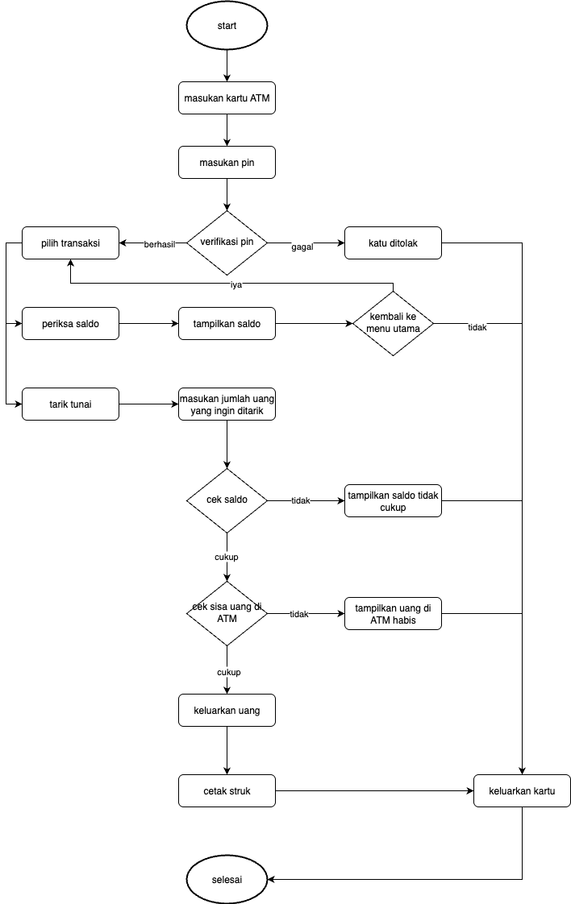

# Personal Assignment Sofware Design

## 1. Bandingkan dan bedakan antara pengembangan perangkat lunak dan pembangunan jembatan fisik!

Pembangunan jembatan fisik sangat terstruktur dan terukur. Step step yang dilakukan tidak mungkin diulang ketika pembangunan sudah dimulai karena cost bisa sangat besar jika ada kesalahan, dimana pada software development ada banyak strategi yang bisa digunakan untuk meminimalisir kemungkinan catastrophic failure.

## 2. Apa kelebihan dan kekurangan penggunaan kelas abstrak untuk merepresentasikan abstraksi data?

- Kelebihan:
  - Untuk mendefinisikan common behavior
  - Untuk mempromosikan reusability untuk mengurangi code duplication
- Kekurangan
  - Tidak selalu cocok untuk semua data
  - Design contract yang buruk akan mempersulit penambahan atau perubahan data

## 3. Buatlak tiga antarmuka yang memodelkan pelanggan, server, dan juru masak dalam operasi restoran. Kemudian, tulis metode (metode statis atau instan) untuk mensimulasikan proses dari pelanggan mengambil pesanan hingga membayar makanan hanya dengan menggunakan metode antarmuka.

```kotlin
interface Customer {
    fun placeOrder(server: Server)
    fun eatFood()
    fun payBill()
}


interface Server {
    fun takeOrder(order: String, customer: Customer)
    fun serveFood(food: String, customer: Customer)
    fun receivePayment(customer: Customer)
}


interface Cook {
    fun prepareFood(order: String, server: Server, customer: Customer)
}


class RestaurantCustomer(private val order: String) : Customer {
    override fun placeOrder(server: Server) {
        println("Customer: I would like to order $order.")
        server.takeOrder(order, this) // Only talks to Server
    }


    override fun eatFood() {
        println("Customer: Eating the food happily!")
    }


    override fun payBill() {
        println("Customer: Paying the bill.")
    }
}


class RestaurantServer(private val cook: Cook) : Server {
    override fun takeOrder(order: String, customer: Customer) {
        println("Server: Taking order -> $order")
        cook.prepareFood(order, this, customer)
    }


    override fun serveFood(food: String, customer: Customer) {
        println("Server: Serving $food to the customer.")
        customer.eatFood()
        receivePayment(customer)
    }


    override fun receivePayment(customer: Customer) {
        customer.payBill()
        println("Server: Payment received. Thank you!")
    }
}


class RestaurantCook : Cook {
    override fun prepareFood(order: String, server: Server, customer: Customer) {
        println("Cook: Preparing $order...")
        println("Cook: $order is ready!")
        server.serveFood(order, customer)
    }
}

fun main() {
    val cook = RestaurantCook()
    val server = RestaurantServer(cook)
    val customer = RestaurantCustomer("Spaghetti")


    customer.placeOrder(server)
}

```

## 4. Pilih salah satu skenario di bawah ini untuk menggambarkan, dengan flowchart, bagaimana sistem tersebut dapat bekerja, lalu identifikasi beberapa modul perangkat lunak dari sistem tersebut seolah-olah Anda diminta untuk merancang sistem tersebut.
- Menarik uang tunai di mesin ATM
- Mengisi tabung gas di pom bensin



## 5. Identifikasi kelemahan desain dari dua kelas berikut dan berikan usulan perbaikannya.

```java
class Email {
    private final String Signature = "Regards";

    public String constructEmail(User recipient, String body) {
        String str = "";
        str += getNiceUserName(recipient);
        str += "\n";
        str += body;
        str += "\n";
        str += Signature;
        return str;
    }

    private String getNiceUserName(User user) {
        return user.firstName() + " " + user.lastName();
    }
}

class User {
    private String first;
    private String last;

    public User(String first, String last) {
        this.first = first;
        this.last = last;
    }

    public String firstName() {
        return first;
    }

    public String lastName() {
        return last;
    }
}
```

- seharusnya fungsi `getNiceUserName()` bagian dari class `User` bukan class `Email`
- properties `last` dan `first` seharusnya immutable
- signature hardcoded, lebih baik jika menjadi constructor class `Email`

```java
class Email {
    private final String signature;

    public Email(String signature) {
        this.signature = signature;
    }

    public String constructEmail(User recipient, String body) {
        String str = "";
        str += recipient.getFullName();
        str += "\n";
        str += body;
        str += "\n";
        str += Signature;
        return str;
    }
}

class User {
    private final String first;
    private final String last;

    public User(String first, String last) {
        if (first == null || last == null || first.isEmpty() || last.isEmpty()) {
            throw new IllegalArgumentException("First and last name must not be null/empty");
        }
        this.first = first;
        this.last = last;
    }

    public String getFirstName() {
        return first;
    }

    public String getLastName() {
        return last;
    }

    public String getFullName() {
        return first + " " + last;
    }
}
```
