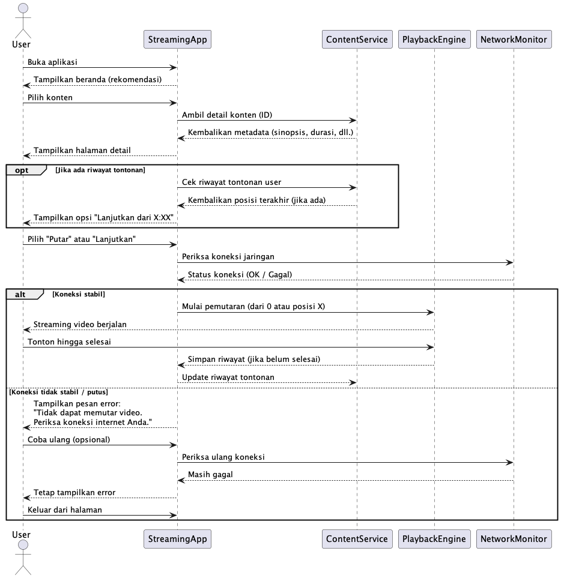
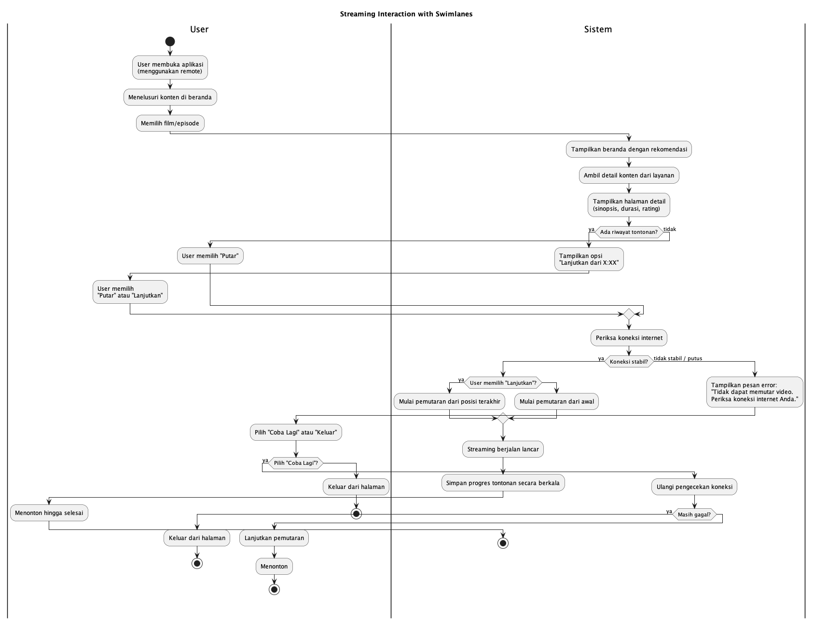
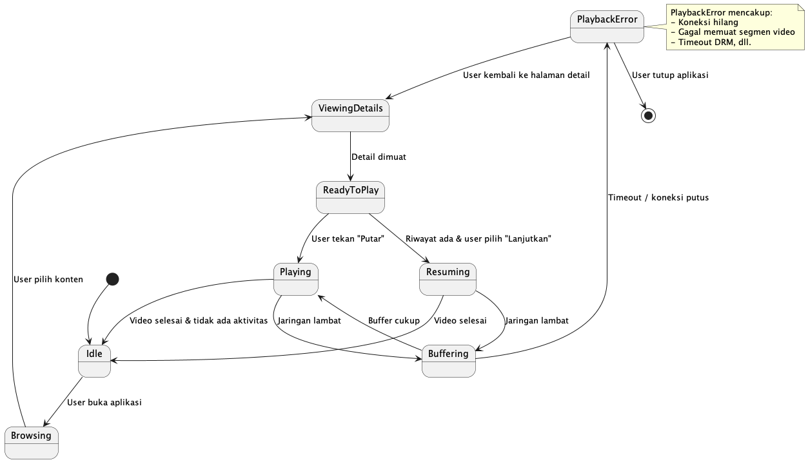
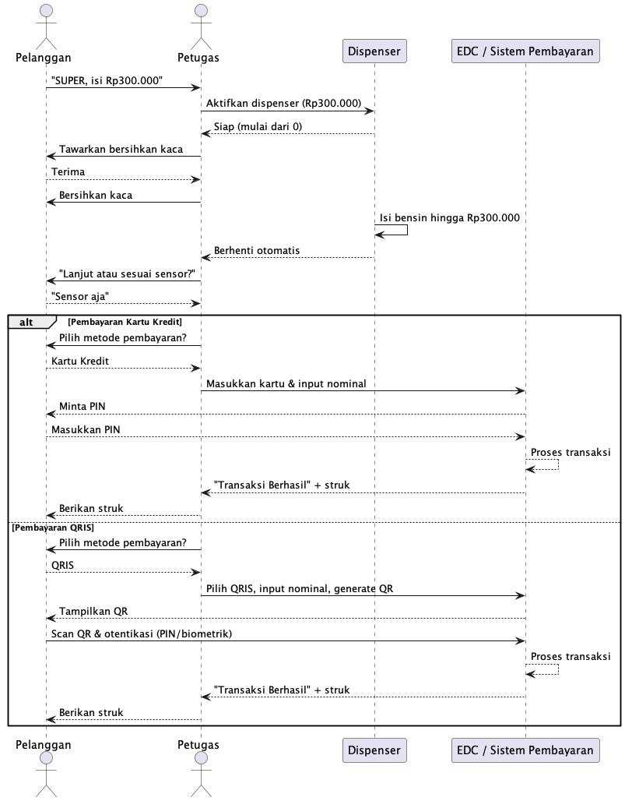
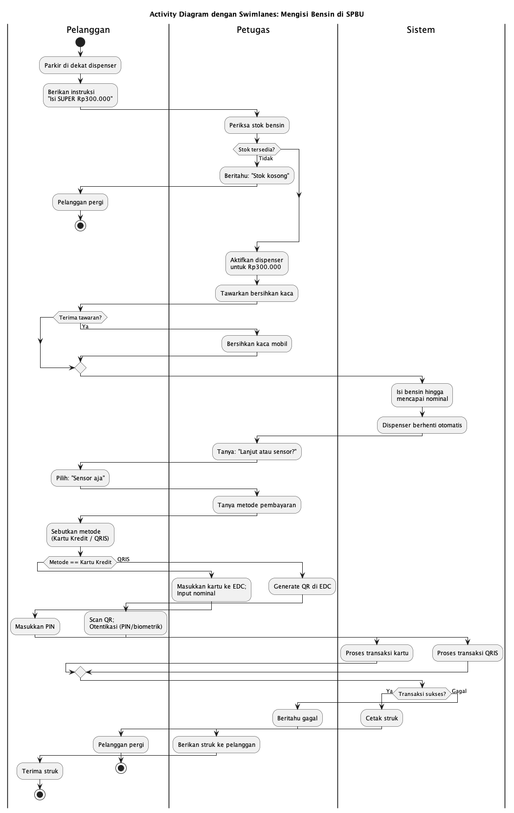
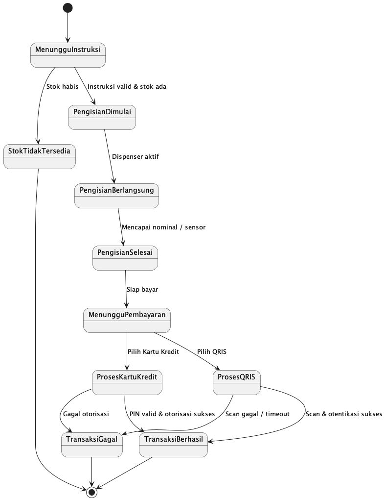
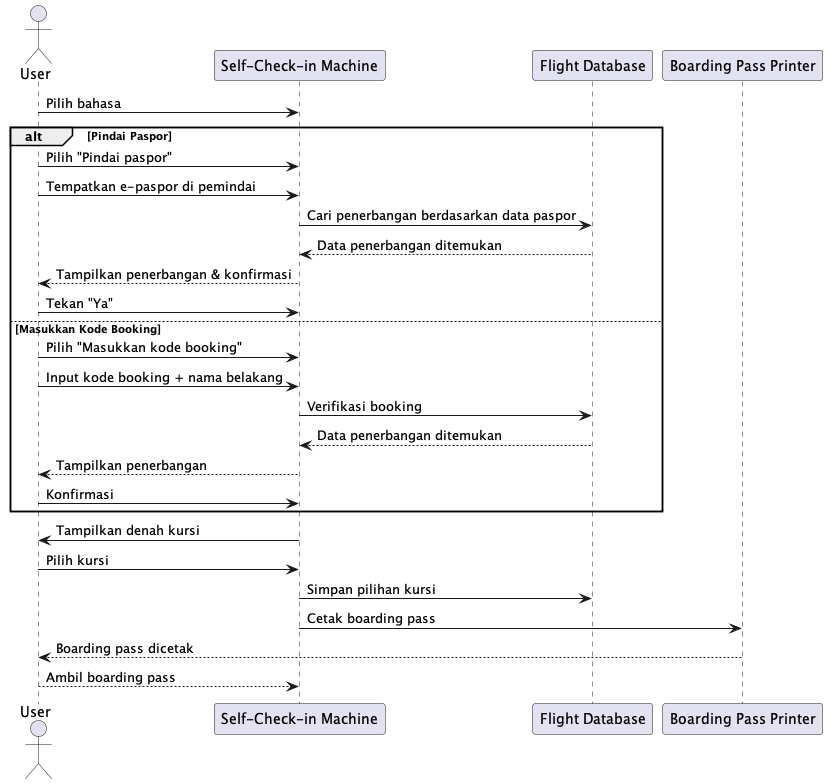
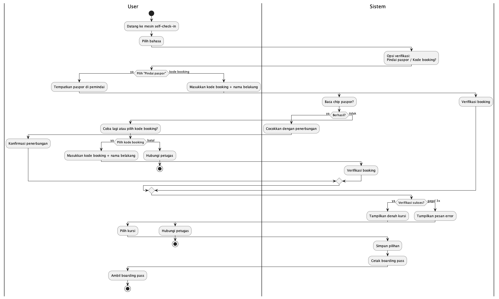
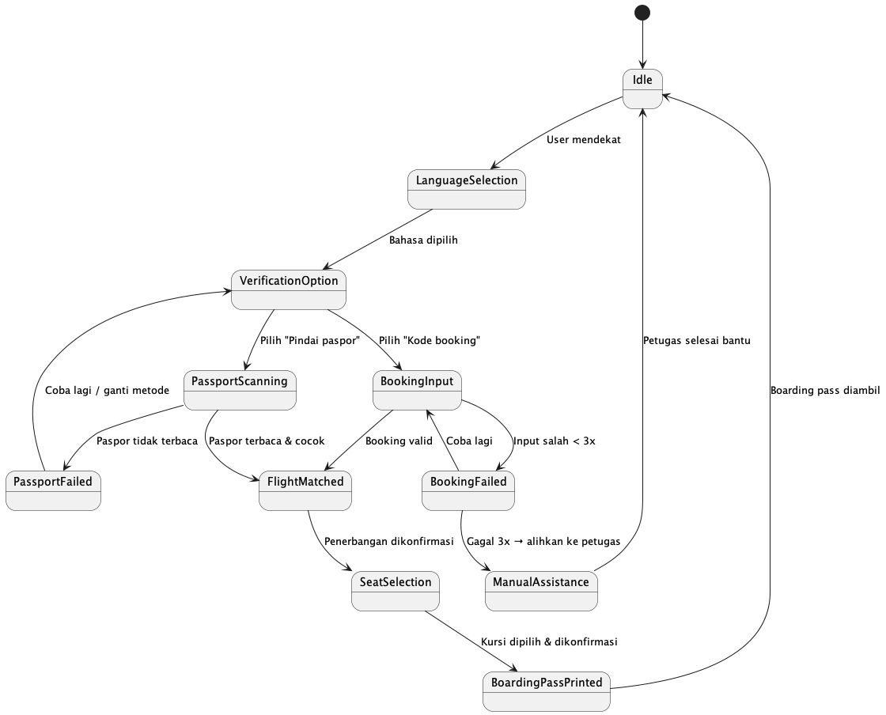

# Personnal assigment 2, 

## 1.(LO 1: 15%) (LN 06 topik Software Modelling Language and Tools)

Tulis usecase skenario untuk setiap kasus perangkat lunak berikut untuk menangkap interaksi pengguna dengan sistem dengan satu skenario normal, satu skenario alternatif, dan satu skenario pengecualian atau kesalahan:

### Seorang pengguna berinteraksi dengan layanan streaming (seperti Netflix, Disney Plus, Hulu, dll.) menggunakan kendali jarak jauh

**Aktor:**
User

**Skenario Normal – Menonton Konten Baru**

1. User membuka aplikasi atau situs web layanan streaming.  
2. Sistem menampilkan antarmuka beranda dengan daftar konten yang direkomendasikan.  
3. User menelusuri daftar dan memilih sebuah film atau episode serial.  
4. Sistem menampilkan halaman detail konten (sinopsis, durasi, rating, dll.).  
5. User memilih opsi **“Putar”**.  
6. Sistem memulai pemutaran video dari awal.  
7. Video diputar dengan lancar sesuai preferensi User (audio, subtitle, kualitas).  
8. User menonton hingga selesai.  
9. Interaksi berhasil diselesaikan.

**Skenario Alternatif – Melanjutkan Tontonan yang Tertunda**

1. User membuka aplikasi atau situs web layanan streaming.  
2. Sistem menampilkan antarmuka beranda dengan daftar konten yang direkomendasikan.  
3. User menelusuri daftar dan memilih sebuah film atau episode serial.  
4. Sistem menampilkan halaman detail konten (sinopsis, durasi, rating, dll.).
5. Sistem mendeteksi bahwa User pernah menonton konten ini sebelumnya dan menampilkan opsi: **“Lanjutkan dari menit X:XX”**.  
6. User memilih opsi tersebut.  
7. Sistem memulai pemutaran dari posisi terakhir yang ditonton.  
8. Video diputar tanpa gangguan.  
9. Interaksi berhasil diselesaikan.

**Skenario Pengecualian – Gagal Memutar Karena Masalah Jaringan**

1. User membuka aplikasi atau situs web layanan streaming.  
2. Sistem menampilkan antarmuka beranda dengan daftar konten yang direkomendasikan.  
3. User menelusuri daftar dan memilih sebuah film atau episode serial.  
4. Sistem menampilkan halaman detail konten (sinopsis, durasi, rating, dll.).
5. Sistem mendeteksi bahwa User pernah menonton konten ini sebelumnya dan menampilkan opsi: **“Lanjutkan dari menit X:XX”**.
6. Sistem mencoba memuat video, tetapi **koneksi internet tidak stabil atau terputus**.  
7. Setelah waktu tunggu habis, sistem menampilkan pesan: **“Tidak dapat memutar video. Periksa koneksi internet Anda.”**  
8. User mencoba memutar ulang — error tetap muncul.  
9. User memutuskan untuk keluar dari halaman atau menutup aplikasi.  
10. Interaksi gagal dan dihentikan.

---

### Mengisi tangki bensin di pom bensin (untuk menangkap operasi pompa bensin yang didukung oleh perangkat lunak)

**Aktor:**
Pelanggan, Petugas SPBU

**Skenario Normal – Pembayaran dengan Kartu Kredit**

1. Pelanggan tiba di SPBU dan memarkir kendaraan di dekat dispenser.  
2. Pelanggan memberi tahu Petugas SPBU: SUPER, isi Rp300.000.”  
3. Petugas mengaktifkan dispenser sesuai nominal yang diminta dan mengatakan "Dimulai dari 0 ya pak".
4. Petugas menawarkan untuk membersihkan kaca mobil.
5. Pelanggan menerima tawaran tersebut.
6. Petugas membersihkan kaca mobil Pelanggan.
7. Bensin mengalir hingga mencapai nilai Rp300.000, lalu dispenser berhenti otomatis.
8. Lalu petugas bertanya kepada pelanggan "mau lanjut atau sesuai sensor?".
9. Pelanggan mengatakan "sensor aja".
10. Setelah selesai, petugas menanyakan kepada pelanggan "mau menggunakan medote pembayaran apa?"
11. Pelanggan mengatakan "Kartu Kredit" dan menyerahkan ka"Kartu Kredit" ke Petugas SPBU.
12. Petugas menyiapkan mesin EDC, memasukan kartu, dan menginput nilai transaksi.  
13. Pelanggan memasukkan PIN.  
14. Mesin EDC menampilkan **“Transaksi Berhasil”** dan mencetak struk.  
15. Petugas memberikan struk kepada Pelanggan.  
16. Transaksi selesai.

**Skenario Alternatif - Pembayaran dengan QRIS**

1. Pelanggan tiba di SPBU dan memarkir kendaraan di dekat dispenser.  
2. Pelanggan memberi tahu Petugas SPBU: SUPER, isi Rp300.000.”  
3. Petugas mengaktifkan dispenser sesuai nominal yang diminta dan mengatakan "Dimulai dari 0 ya pak".
4. Petugas menawarkan untuk membersihkan kaca mobil.
5. Pelanggan menerima tawaran tersebut.
6. Petugas membersihkan kaca mobil Pelanggan.
7. Bensin mengalir hingga mencapai nilai Rp300.000, lalu dispenser berhenti otomatis.
8. Lalu petugas bertanya kepada pelanggan "mau lanjut atau sesuai sensor?".
9. Pelanggan mengatakan "sensor aja".
10. Setelah selesai, petugas menanyakan kepada pelanggan "mau menggunakan medote pembayaran apa?"
11. Pelanggan mengatakan "QRIS".
12. Petugas menyiapkan mesin EDC, memilih menu "QRIS", menginput nilai transaksi dan mengenerate QR untuk transaksi.  
13. Pelanggan melakukan scan QR dengan smartphone miliknya, lalu melanjutkan transaksi dengan memasukan pin/authentikasi finger print/ face recognition dan pada layar smarphone menampilkan **“Transaksi Berhasil”**.  
14. Mesin EDC juga menampilkan **“Transaksi Berhasil”** dan mencetak struk.  
15. Petugas memberikan struk kepada Pelanggan.  
16. Transaksi selesai.

**Skenario Pengecualian - masalah stok pada SPBU**

1. Pelanggan tiba di SPBU dan memarkir kendaraan di dekat dispenser.  
2. Pelanggan memberi tahu Petugas SPBU: SUPER, isi Rp300.000.”
3. Petugas mengatakan ke pelanggan "semua bensin masih kosong pak"
4. Pelanggan meninggalkan SPBU
5. Selesai

---

### Melakukan Pembayaran Mandiri di Toko Kelontong  

**Aktor:**
User

**Skenario Normal – Pembayaran Berhasil dengan QRIS**

1. User selesai berbelanja dan membawa barang ke mesin kasir swalayan.  
2. User menempatkan satu per satu barang di area pemindai.  
3. Sistem mendeteksi barcode dan menampilkan nama barang, harga, serta total sementara di layar.  
4. Setelah semua barang dipindai, sistem menampilkan **total akhir** (misalnya: Rp47.500).  
5. User memilih metode pembayaran: **QRIS**.  
6. Sistem menampilkan kode QR pembayaran di layar.  
7. User memindai kode QR tersebut menggunakan aplikasi e-wallet (GoPay, DANA, dll.).  
8. Aplikasi menampilkan konfirmasi, dan User menyetujui transaksi.  
9. Sistem menerima notifikasi pembayaran sukses dan mencetak struk (atau menawarkan struk digital).  
10. User mengambil struk dan barang, lalu meninggalkan toko.  
11. Transaksi selesai.

**Skenario Alternatif – Pembayaran Tunai dengan Kembalian Otomatis**

1. User selesai berbelanja dan membawa barang ke mesin kasir swalayan.  
2. User menempatkan satu per satu barang di area pemindai.  
3. Sistem mendeteksi barcode dan menampilkan nama barang, harga, serta total sementara di layar.  
4. Setelah semua barang dipindai, sistem menampilkan **total akhir** (misalnya: Rp47.500).  
5. User memilih metode pembayaran: **Tunai**.  
6. Sistem meminta User memasukkan uang ke dalam slot penerima uang tunai.  
7. User memasukkan uang kertas (misalnya: Rp100.000).  
8. Sistem memverifikasi keaslian dan nominal uang, lalu menghitung kembalian (Rp52.500).  
9. Mesin mengeluarkan kembalian melalui slot koin/uang kertas.  
10. Sistem mencetak struk.  
11. User mengambil kembalian, struk, dan barang.  
12. Transaksi selesai.

**Skenario Pengecualian – Barang Tidak Terbaca atau Tanpa Barcode**

1. User mencoba memindai sebuah barang (misalnya: cabai segar dalam kantong plastik) yang **tidak memiliki barcode**.  
2. Pemindai gagal mengenali barang.  
3. Sistem menampilkan pesan: **“Barcode tidak terbaca. Silakan pilih barang secara manual.”**  
4. User menekan tombol **“Cari Barang”** di layar.  
5. User mencari barang berdasarkan kategori (misalnya: “Sayur”) lalu memilih “Cabai Merah – Rp35.000/kg”.  
6. Sistem meminta User memasukkan berat (jika tersedia timbangan terintegrasi) atau memilih perkiraan berat (misalnya: 250 gram).  
7. Sistem menambahkan harga proporsional (Rp8.750) ke total.  
8. User melanjutkan pemindaian barang lainnya.  
9. Jika tidak ada timbangan dan User tidak bisa memasukkan berat, sistem meminta bantuan petugas.  
10. Petugas datang, memasukkan harga manual, lalu User melanjutkan pembayaran seperti biasa.  
11. Transaksi selesai dengan bantuan minimal.

---

### Melakukan Self Check-in di Bandara

**Aktor:**
User

**Skenario Normal – Self Check-in Berhasil dengan Paspor dan Pencetakan Boarding Pass**

1. User tiba di area keberangkatan bandara dan mendekati mesin self-check-in.  
2. User memilih bahasa antarmuka (misalnya: Bahasa Indonesia).  
3. Sistem menampilkan opsi verifikasi identitas: **“Pindai paspor”** atau **“Masukkan kode booking”**.  
4. User memilih **“Pindai paspor”** dan menempatkan e-paspor di area pemindai.  
5. Sistem membaca data paspor dan mencocokkannya dengan daftar penerbangan hari ini.  
6. Sistem menampilkan penerbangan yang sesuai dan menawarkan: **“Lanjutkan check-in untuk [Maskapai] pukul 10.30?”**  
7. User menekan **“Ya”**.  
8. Sistem menampilkan denah kabin dan memungkinkan User memilih kursi (jika tersedia gratis).  
9. User memilih kursi, lalu menekan **“Konfirmasi”**.  
10. Sistem memproses check-in dan mencetak **boarding pass**.  
11. User mengambil boarding pass dan melanjutkan ke pemeriksaan keamanan.  
12. Proses check-in selesai.

**Skenario Alternatif – Check-in Menggunakan Kode Booking (Tanpa Paspor)**

1. User mendekati mesin self-check-in.  
2. User memilih bahasa, lalu memilih opsi **“Masukkan kode booking”**.  
3. User memasukkan **kode booking 6 digit** dan **nama belakang** sesuai tiket.  
4. Sistem memverifikasi data dan menampilkan penerbangan yang sesuai.  
5. User mengonfirmasi penerbangan.  
6. Sistem menampilkan opsi pemilihan kursi (jika belum ditentukan).  
7. User memilih kursi standar gratis.  
8. Sistem mencetak boarding pass.  
9. User mengambil boarding pass dan melanjutkan perjalanan.  
10. Proses check-in selesai.

**Skenario Pengecualian – Paspor Tidak Terbaca atau Tidak Kompatibel**

1–3. Sama seperti skenario normal hingga User memilih **“Pindai paspor”**.  
4. User menempatkan paspor di pemindai, tetapi sistem **gagal membaca chip** (karena paspor lama, rusak, atau posisi salah).  
5. Sistem menampilkan pesan: **“Paspor tidak terbaca. Silakan coba lagi atau gunakan kode booking.”**  
6. User mencoba sekali lagi — tetap gagal.  
7. User memilih opsi **“Gunakan kode booking”**.  
8. User memasukkan kode booking dan nama belakang secara manual.  
9. Sistem berhasil mengenali penerbangan dan melanjutkan proses check-in seperti biasa.  
10. Jika kode booking juga gagal (misalnya salah ketik 3 kali), sistem menampilkan: **“Silakan hubungi petugas di konter bantuan.”**  
11. User mendekati petugas untuk bantuan manual.  
12. Proses check-in dialihkan ke layanan manusia.

---

## (LO 2; 20%) (LN 07 topik - Design of Larger Software Elements)

Dari nomor 1, Jelaskan dan gambarkan proses perangkat lunak menggunakan diagram sequence, diagram activity, diagram state machine!

### Sequence diagram streaming service

### Activity diagram streaming service

### State machine streaming service


---

### Sequence diagram pom bensin

### Activity diagram pom bensin

### State machine pom bensin


---

### Sequence diagram self checkin di bandara

### Activity diagram self checkin di bandara

### State machine self checkin di bandara


---


## (LO 3; 25%) (LN 08 topik - Software Design Patterns)
Gunakan pola Abstract Factory untuk membuat pabrik dengan dua produk tombol: satu yang mengubah warna latar belakang tombol saat mouse diarahkan dan yang lainnya yang mengubah dua warna latar belakang saat diklik.

---

### Struktur Pola dalam Kotlin

```kotlin
// -------------------------
// Abstract Product (as abstract class)
// -------------------------
abstract class Button {
    protected var currentColor: String = "default"

    abstract fun render()
    abstract fun onHover()
    abstract fun onClick()
}

// -------------------------
// Concrete Products
// -------------------------
class HoverButton(
    private val normalColor: String = "white",
    private val hoverColor: String = "lightblue"
) : Button() {

    init {
        currentColor = normalColor
    }

    override fun render() {
        println("[HoverButton] Rendered with color: $currentColor")
    }

    override fun onHover() {
        currentColor = hoverColor
        println("[HoverButton] Hovered → color changed to $currentColor")
    }

    override fun onClick() {
        println("[HoverButton] Clicked (no color change on click)")
    }
}

class ClickButton(
    private val color1: String = "green",
    private val color2: String = "red"
) : Button() {

    private var isColor1 = true

    init {
        currentColor = color1
    }

    override fun render() {
        println("[ClickButton] Rendered with color: $currentColor")
    }

    override fun onHover() {
        println("[ClickButton] Hovered (no color change on hover)")
    }

    override fun onClick() {
        currentColor = if (isColor1) color2 else color1
        isColor1 = !isColor1
        println("[ClickButton] Clicked → color toggled to $currentColor")
    }
}

// -------------------------
// Abstract Factory
// -------------------------
abstract class ButtonFactory {
    abstract fun createButton(): Button
}

// -------------------------
// Concrete Factories
// -------------------------
class HoverButtonFactory : ButtonFactory() {
    override fun createButton(): Button = HoverButton()
}

class ClickButtonFactory : ButtonFactory() {
    override fun createButton(): Button = ClickButton()
}

// -------------------------
// Client Code
// -------------------------
fun simulateUI(factory: ButtonFactory) {
    val button = factory.createButton()
    button.render()
    button.onHover()
    button.onClick()
    button.onClick()
}

// -------------------------
// Main
// -------------------------
fun main() {
    println("=== Hover Button ===")
    simulateUI(HoverButtonFactory())

    println("\n=== Click Button ===")
    simulateUI(ClickButtonFactory())
}
```

***Sample output***
```
=== Hover Button ===
[HoverButton] Rendered with color: white
[HoverButton] Hovered → color changed to lightblue
[HoverButton] Clicked (no color change on click)
[HoverButton] Clicked (no color change on click)

=== Click Button ===
[ClickButton] Rendered with color: green
[ClickButton] Hovered (no color change on hover)
[ClickButton] Clicked → color toggled to red
[ClickButton] Clicked → color toggled to green
```


## (LO 3; 50%) (LN 09 topik - Software Architecture and Architecture Views; LN 05 topik - Design case studies)

Asumsikan Anda ingin menulis program Java yang menganimasikan bola yang bergerak bebas dan terpantul saat mengenai tepi (lalu bergerak ke arah pantulan). Bola dimanipulasi dengan utas terpisah.

Berikan tampilan logika dari Model Tampilan 4+1 yang berfokus pada cara kerja program pada tingkat tinggi dan tampilan proses yang berfokus pada cara thread bola berinteraksi dengan thread utama.

Berikut adalah dua tampilan dari **Model Arsitektur 4+1** yang relevan untuk program Java animasi bola yang bergerak bebas dan memantul di tepi, dengan manipulasi menggunakan **thread terpisah**:

---

### 1. Logical View

- **Class `BouncingBall`**  
  - Merepresentasikan bola tunggal.
  - Memiliki atribut: posisi `(x, y)`, kecepatan `(dx, dy)`, radius, dan warna.
  - Memiliki metode:  
    - `updatePosition()` → memperbarui posisi berdasarkan kecepatan.  
    - `checkCollision()` → mendeteksi tabrakan dengan batas jendela dan membalik arah kecepatan jika perlu.  
    - `draw(Graphics g)` → menggambar bola di layar.

- **Class `BallThread` (extends `Thread` atau implements `Runnable`)**  
  - Menjalankan logika pergerakan bola dalam **thread terpisah**.
  - Di dalam `run()`:

```java
while (running) {
    ball.updatePosition();
    ball.checkCollision();
    panel.repaint(); // memicu penggambaran ulang
    Thread.sleep(DELAY);
}
```

- **Class `AnimationPanel` (extends `JPanel`)**  
  - Bertanggung jawab atas **tampilan grafis**.
  - Meng-override `paintComponent(Graphics g)` untuk menggambar bola.
  - Menyediakan akses aman ke objek bola (misalnya melalui sinkronisasi atau antrean).

- **Class `MainApp`**  
  - Titik masuk aplikasi (`main` method).
  - Membuat `JFrame`, menambahkan `AnimationPanel`, dan memulai `BallThread`.

---

### 2. Tampilan Proses (Process View)

- **Thread Utama (Main Thread)**  
  - Menjalankan inisialisasi GUI (Swing): membuat `JFrame`, `AnimationPanel`, dll.
  - Memulai **BallThread** setelah GUI siap.
  - Menangani event UI (misalnya tombol mulai/berhenti).

- **BallThread (Worker Thread)**  
  - Berjalan secara **konkuren** dengan thread utama.
  - Secara periodik (misalnya tiap 16 ms ≈ 60 FPS):
    1. Memperbarui posisi dan kecepatan bola (`updatePosition`, `checkCollision`).
    2. Memanggil `repaint()` pada `AnimationPanel`.
  - **Tidak mengakses komponen GUI secara langsung** (karena aturan Swing: hanya EDT yang boleh mengubah GUI).
    - `repaint()` aman karena bersifat *asynchronous* dan dijadwalkan oleh **Event Dispatch Thread (EDT)**.

- **Event Dispatch Thread (EDT)**  
  - Thread internal Swing yang menangani semua operasi GUI.
  - Menerima permintaan `repaint()` dari `BallThread` dan menjalankan `paintComponent()`.

- **Sinkronisasi**  
  - Jika ada **beberapa bola**, akses ke daftar bola harus disinkronisasi (misalnya dengan `synchronized` block atau `ConcurrentHashMap`).
  - Untuk satu bola, biasanya cukup dengan membuat atribut bola **volatile** atau mengandalkan fakta bahwa `repaint()` tidak membaca state secara langsung.

---